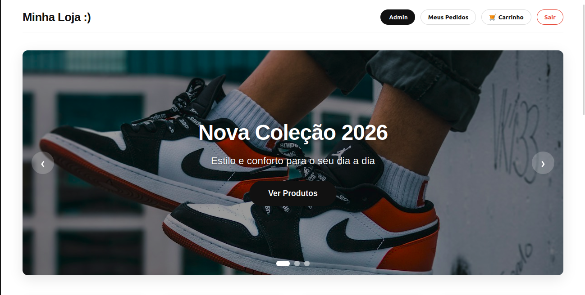
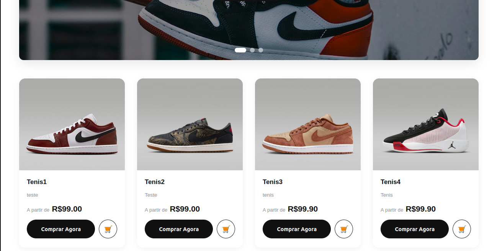
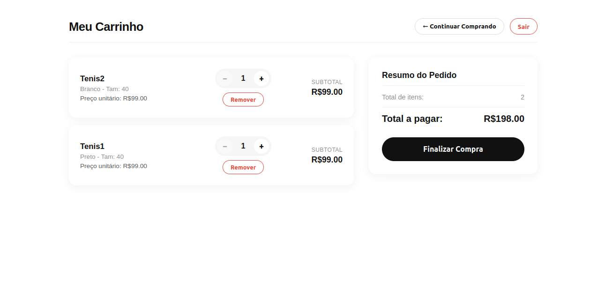

cat << 'EOF' > ~/Área\ de\ Trabalho/Vendas/README.md
# 🛒 Sistema de E-commerce Full Stack - API RESTful & Angular

Sistema completo de e-commerce Full Stack, desenvolvido com **Spring Boot** (Backend) e **Angular** (Frontend). O projeto implementa um fluxo real de vendas, desde o gerenciamento de produtos pelo administrador até a finalização de compra pelo cliente, com autenticação segura via JWT e controle de acesso baseado em papéis (RBAC).

---

## 📸 Screenshots do Sistema

### 🔐 Tela de Login/Cadastro

### 🏪 Página Inicial da Loja

### 🛍️ Catálogo de Produtos

### 📊 Painel Administrativo (Dashboard)

### 🛒 Carrinho de Compras

---

## ✨ Funcionalidades Principais

### 👤 Módulo do Cliente
- ✅ Cadastro e Login com JWT
- ✅ Catálogo de Produtos com Hero Carousel
- ✅ Carrinho de Compras com "Comprar Agora"
- ✅ Checkout com baixa automática de estoque
- ✅ Histórico de Pedidos com detalhes

### ️ Módulo do Administrador
- ✅ Dashboard com métricas (Faturamento, Pedidos, Estoque Baixo)
- ✅ CRUD Completo de Produtos com Upload de Imagens
- ✅ CRUD de Categorias
- ✅ Gestão de Status de Pedidos
- ✅ Controle de acesso RBAC

---

## 🛠️ Stack Tecnológica

| Categoria | Tecnologia | Propósito |
| :--- | :--- | :--- |
| **Backend** | Java 17, Spring Boot 3.3.x | API RESTful |
| **Segurança** | Spring Security, JJWT, BCrypt | Autenticação JWT |
| **Persistência** | Spring Data JPA, PostgreSQL | Banco de dados |
| **Frontend** | Angular 17+, TypeScript, RxJS | SPA moderna |
| **Testes** | JUnit 5, Mockito, MockMvc | Testes automatizados |

---

Vendas/
│
├── backend/
│   └── api/
│       ├── .mvn/wrapper/
│       ├── src/
│       │   ├── main/
│       │   │   ├── java/com/sualoja/api/
│       │   │   │   ├── config/
│       │   │   │   │   ├── OpenApiConfig.java
│       │   │   │   │   ├── SecurityConfig.java
│       │   │   │   │   └── WebConfig.java
│       │   │   │   │
│       │   │   │   ├── controller/
│       │   │   │   │   ├── AuthController.java
│       │   │   │   │   ├── CartController.java
│       │   │   │   │   ├── CategoryController.java
│       │   │   │   │   ├── DashboardController.java
│       │   │   │   │   ├── OrderController.java
│       │   │   │   │   ├── ProductController.java
│       │   │   │   │   └── ProductVariantController.java
│       │   │   │   │
│       │   │   │   ├── dto/
│       │   │   │   │   ├── request/
│       │   │   │   │   │   ├── AddToCartRequest.java
│       │   │   │   │   │   ├── CadastroRequest.java
│       │   │   │   │   │   ├── CheckoutRequest.java
│       │   │   │   │   │   ├── CreateCategoryRequest.java
│       │   │   │   │   │   ├── CreateProductRequest.java
│       │   │   │   │   │   ├── CreateProductVariantRequest.java
│       │   │   │   │   │   ├── LoginRequest.java
│       │   │   │   │   │   ├── ProductRequest.java
│       │   │   │   │   │   ├── ProductVariantRequest.java
│       │   │   │   │   │   ├── UpdateCartItemRequest.java
│       │   │   │   │   │   ├── UpdateCategoryRequest.java
│       │   │   │   │   │   ├── UpdateProductRequest.java
│       │   │   │   │   │   └── UpdateProductVariantRequest.java
│       │   │   │   │   │
│       │   │   │   │   └── response/
│       │   │   │   │       ├── AuthResponse.java
│       │   │   │   │       ├── CartItemResponse.java
│       │   │   │   │       ├── CartResponse.java
│       │   │   │   │       ├── CategoryResponse.java
│       │   │   │   │       ├── DashboardResponse.java
│       │   │   │   │       ├── OrderItemResponse.java
│       │   │   │   │       ├── OrderResponse.java
│       │   │   │   │       ├── ProductResponse.java
│       │   │   │   │       └── ProductVariantResponse.java
│       │   │   │   │
│       │   │   │   ├── exception/
│       │   │   │   │   ├── GlobalExceptionHandler.java
│       │   │   │   │   ── ResourceNotFoundException.java
│       │   │   │   │
│       │   │   │   ├── model/
│       │   │   │   │   ├── entity/
│       │   │   │   │   │   ├── Cart.java
│       │   │   │   │   │   ├── CartItem.java
│       │   │   │   │   │   ├── Category.java
│       │   │   │   │   │   ├── Order.java
│       │   │   │   │   │   ├── OrderItem.java
│       │   │   │   │   │   ├── Product.java
│       │   │   │   │   │   ├── ProductVariant.java
│       │   │   │   │   │   └── User.java
│       │   │   │   │   │
│       │   │   │   │   └── enums/
│       │   │   │   │       ├── CartStatus.java
│       │   │   │   │       ├── OrderStatus.java
│       │   │   │   │       └── UserRole.java
│       │   │   │   │
│       │   │   │   ├── repository/
│       │   │   │   │   ├── CartItemRepository.java
│       │   │   │   │   ├── CartRepository.java
│       │   │   │   │   ├── CategoryRepository.java
│       │   │   │   │   ├── OrderItemRepository.java
│       │   │   │   │   ├── OrderRepository.java
│       │   │   │   │   ├── ProductRepository.java
│       │   │   │   │   ├── ProductVariantRepository.java
│       │   │   │   │   └── UserRepository.java
│       │   │   │   │
│       │   │   │   ├── security/
│       │   │   │   │   ├── CustomUserDetailsService.java
│       │   │   │   │   ├── JwtAuthenticationFilter.java
│       │   │   │   │   └── JwtService.java
│       │   │   │   │
│       │   │   │   ├── service/
│       │   │   │   │   ├── AuthService.java
│       │   │   │   │   ├── CartService.java
│       │   │   │   │   ├── CategoryService.java
│       │   │   │   │   ├── FileStorageService.java
│       │   │   │   │   ├── OrderService.java
│       │   │   │   │   ├── ProductService.java
│       │   │   │   │   └── ProductVariantService.java
│       │   │   │   │
│       │   │   │   └── ApiApplication.java
│       │   │   │
│       │   │   └── resources/
│       │   │       ├── application.yml
│       │   │       └── db/migration/
│       │   │           ├── V1__create_initial_tables.sql
│       │   │           └── V4__add_image_url_to_products.sql
│       │   │
│       │   └── test/
│       │       ├── java/com/sualoja/api/
│       │       │   ├── ApiApplicationTests.java
│       │       │   ├── integration/
│       │       │   │   ├── AuthIntegrationTest.java
│       │       │   │   ├── CartIntegrationTest.java
│       │       │   │   ├── OrderIntegrationTest.java
│       │       │   │   └── ProductIntegrationTest.java
│       │       │   └── service/
│       │       │       └── OrderServiceTest.java
│       │       └── resources/
│       │           └── application.yml
│       │
│       ├── uploads/produtos/
│       ├── pom.xml
│       └── configuracao-testes-h2.yml
│
── frontend/
│   ├── public/
│   │   └── favicon.ico
│   │
│   ├── src/
│   │   ├── app/
│   │   │   ├── core/
│   │   │   │   ├── interceptors/
│   │   │   │   │   └── auth.interceptor.ts
│   │   │   │   │
│   │   │   │   └── services/
│   │   │   │       ├── auth.service.ts
│   │   │   │       ├── cart.service.ts
│   │   │   │       ├── category.service.ts
│   │   │   │       ├── dashboard.service.ts
│   │   │   │       ├── order.service.ts
│   │   │   │       └── product.service.ts
│   │   │   │
│   │   │   ├── features/
│   │   │   │   ├── admin/
│   │   │   │   │   ├── admin-categories.component.ts
│   │   │   │   │   ├── admin-category-form.component.ts
│   │   │   │   │   ├── admin-dashboard.component.ts
│   │   │   │   │   ├── admin-orders.component.ts
│   │   │   │   │   ├── admin-product-form.component.ts
│   │   │   │   │   ── admin-products.component.ts
│   │   │   │   │
│   │   │   │   ├── cart/
│   │   │   │   │   └── cart.component.ts
│   │   │   │   │
│   │   │   │   ├── login/
│   │   │   │   │   └── login.component.ts
│   │   │   │   │
│   │   │   │   ├── orders/
│   │   │   │   │   ├── order-details.component.ts
│   │   │   │   │   └── orders.component.ts
│   │   │   │   │
│   │   │   │   ├── products/
│   │   │   │   │   └── products.component.ts
│   │   │   │   │
│   │   │   │   └── shared/
│   │   │   │       └── hero-carousel.component.ts
│   │   │   │
│   │   │   ├── app.component.ts
│   │   │   ├── app.config.ts
│   │   │   └── app.routes.ts
│   │   │
│   │   ├── index.html
│   │   ├── main.ts
│   │   └── styles.scss
│   │
│   ├── angular.json
│   ├── package.json
│   ├── proxy.conf.json
│   ├── tsconfig.json
│   ├── tsconfig.app.json
│   └── tsconfig.spec.json
│
├── docs/
│   └── screenshots/
│       ├── carrinho.png
│       ├── criacaoDeCategorias.png
│       ├── criacaoDeProdutos.png
│       ├── dashboard.png
│       ├── login.png
│       ├── pageInicial.png
│       └── produtos.png
│
└── README.md

---

## 🚀 Como Rodar o Projeto

### Pré-requisitos
- JDK 17+ e Maven
- Node.js 18+ e Angular CLI
- PostgreSQL rodando na porta 5432

1. backend

cd backend/api
mvn spring-boot:run

2. Frontend

cd frontend
ng serve -o

Admin:
	
admin@teste.com
	
123456

Cliente:
	
lucas@teste.com
	
123456

---

🔜 Próximos Passos

    Deploy em nuvem (Vercel + Render)
    Integração com gateway de pagamento
    Busca e filtros avançados
    Notificações Toast

	
